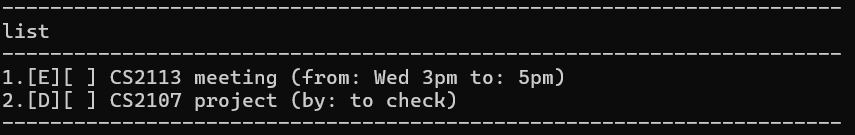

TaskMaster is a **task tracker chatbot** that can help keep track of todos, deadlines and events via a **Command Line Interface (CLI)**
* * *

# Quick Start

1. Ensure that you have Java `17` or above installed in your Computer. If not, you can follow this [guide](https://se-education.org/guides/tutorials/javaInstallation.html)
2. Download the latest `.jar` file from [here](https://github.com/Emannuel-Tan/ip)
3. Copy the file to the folder you want to use as the home folder for TaskMaster (Preferably an empty folder, though it will work regardless)
4. Open a command terminal and `cd` into the folder that you put the jar in, and use the `java -jar ip.jar` command to run the application
5. Refer to the [Features](#features) below for details of each command

* * *

# Features

## List Tasks: ```list```
Outputs to the terminal the list of all saved tasks

Format: ```list```


## Exit Program: ```bye```
Exits the program 

Format: ```bye```


## Add a ToDo Task: ```todo```
Adds a task to be done

Format: ```todo <task>```

Examples: 
- ```todo buy new pen ink``` 
- ```todo work on personal project```


## Add a Deadline Task: ```deadline```
Adds a task with a deadline

Format: ```deadline <task> /by <deadline>```\
```<deadline>``` can be of format `<text>` and/or `<dd-mm-yyyy>`

Examples:
- ```deadline submit homework /by Tuesday 2359```
- ```deadline submit coursework /by 22-09-2025```
- ```deadline complete quiz /by tmr 22-09-2025```


## Add an Event: ```event```
Adds an event with a from and to

Format: ```event <event_name> /from <start_time> /to <end_time>```\
```<start_time>``` and/or ```<end_time>``` can be of format `<text>` and/or `<dd-mm-yyyy>`

Examples:
- ```event CCA Fair /from Monday /to Friday```
- ```event IT Show /from 21-09-2025 /to end September 30-09-2025```
- ```event CS2113 ip /from 21-09-2025 /to Friday Oct 3rd 2359```


## Mark Task: ```mark```
Marks a task as done (task_number is shown when using `list`)

Format: ```mark <task_number>```

Examples:
- ```mark 1``` Marks the task at index 1 as done 
- ```mark 3``` Marks the task at index 3 as done


## Unmark Task: ```unmark```
Marks a task as not done (task_number is shown when using `list`)

Format: ```unmark <task_number>```

Examples:
- ```unmark 1``` Marks the task at index 1 as not done
- ```unmark 3``` Marks the task at index 3 as not done


## Delete Task: ```delete```
Deletes a task (task_number is shown when using `list`)

Format: ```delete <task_number>```

Examples:
- ```delete 1``` Deletes the task at index 1
- ```delete 3``` Deletes the task at index 3


## Find Task: ```find```
Finds & Outputs all tasks that contain a keyword, case-insensitive

Format: ```find <keyword>```

Examples:
- ```find exam``` Finds all tasks that contain keyword "exam"
- ```find buy``` Finds all tasks that contain keyword "buy"


* * *

# Saving the data
TaskMaster data are saved in the hard disk automatically before the exit of the program. There is no need to save manually

# Editing the data file
TaskMaster data are saved automatically as a txt file `[JAR FILE LOCATION]/data/TaskMaster.txt`. Advanced users are welcome to update data directly by editing the data file.

**Caution!!!:** Only edit the data file if you are confident that you can update it correctly

* * *

# Command Summary

| Action   | Format, Examples                                                                                                          |
|----------|---------------------------------------------------------------------------------------------------------------------------|
| list     | `list`                                                                                                                    |
| bye      | `bye`                                                                                                                     |
| todo     | `todo <task>`<br/> e.g. `todo buy ink`                                                                                    |
| deadline | `deadline <task> /by <deadline>`<br/> e.g. `deadline homework /by Thursday 02-10-2025`                                    |
| event    | `event <event_name> /from <start_time> /to <end_time>`<br/> e.g. `event IT show /from Tue 30-09-2025 /to Thur 02-10-2025` |
| mark     | `mark <task_number>`<br/> e.g. `mark 1`                                                                                   |
| unmark   | `unmark <task_number>`<br/> e.g. `unmark 1`                                                                               |
| delete   | `delete <task_number>`<br/> e.g. `delete 1`                                                                               |
| find     | `find <keyword>` <br/> e.g. `find exam`                                                                                   |
